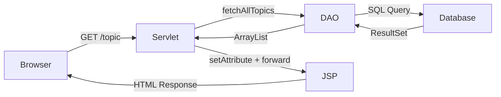
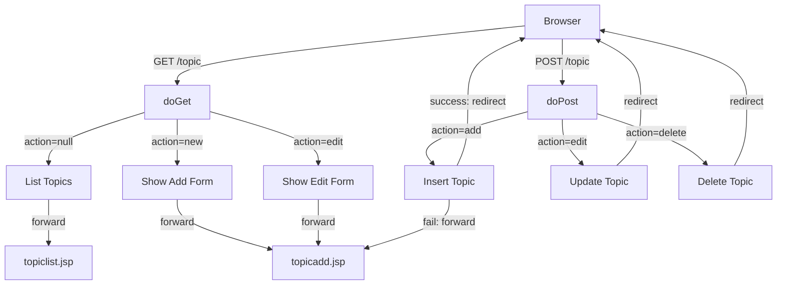
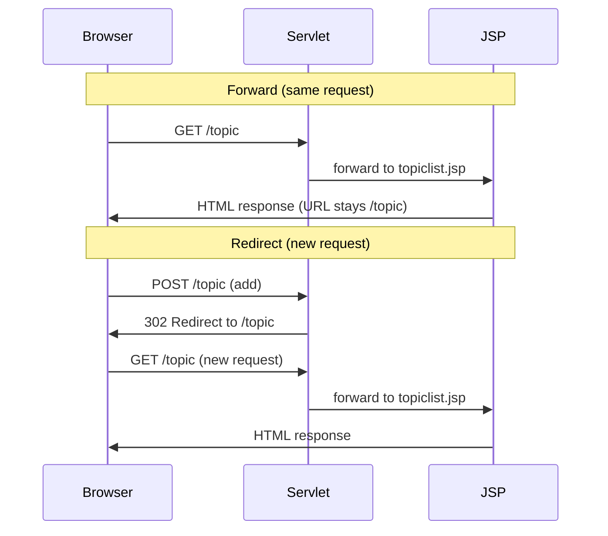

# Learning Logs Web — Tutorial

## Week 4 — Tutorial: JSP & Servlets

> **From static to dynamic — your pages come alive.**

In Weeks 1–2, you built a Java backend with entities, DAOs, and a terminal menu. In Week 3, you gave it a face with HTML pages and CSS styling. Now in Week 4, you connect them — your servlet handles requests, talks to the database, and forwards data to JSP pages that render it dynamically.

---

## What's Already Done

These files are **provided and complete** — no changes needed:

| Layer | Files | From |
|-------|-------|------|
| Entity | `Topic.java`, `Entry.java` | Week 2 (Entry updated with title, link, image) |
| DAO | `TopicDao.java`, `TopicDaoImpl.java`, `EntryDao.java`, `EntryDaoImpl.java` | Week 2 |
| Database | `DatabaseConnection.java` | Week 2 |
| CSS | `main.css`, `topic-list.css`, `topic-add.css` | Week 3 |
| Database Schema | `sql/learninglog.sql`, `sql/seed.sql` | Week 2 (updated) |
| Config | `pom.xml`, `web.xml`, `.gitignore` | New for Week 4 |

---

## What You'll Build

| File | What It Does |
|------|-------------|
| `TopicServlet.java` | Handles all topic HTTP requests (list, add, edit, delete) |
| `topiclist.jsp` | Displays topics dynamically using JSTL forEach + EL |
| `topicadd.jsp` | Add/edit form with error handling using JSTL + EL |
| `TopicDao.java` | Add 3 new method signatures (findById, update, delete) |
| `TopicDaoImpl.java` | Implement the 3 new DAO methods |

---

## Architecture

### How a Request Flows



### GET vs POST Flow



### Forward vs Redirect



---

## Project Structure

```
learning-logs-web-jsp-tutorial/
├── pom.xml                                    WAR packaging + Jakarta EE deps
├── sql/
│   ├── learninglog.sql                        Database schema
│   └── seed.sql                               Sample data
├── references/                                14 video summary guides
├── wireframes/                                UI reference images
├── src/main/
│   ├── java/com/learninglogs/
│   │   ├── controller/
│   │   │   └── TopicServlet.java              ★ TODOs 7-12
│   │   ├── entity/
│   │   │   ├── Topic.java                     Provided
│   │   │   └── Entry.java                     Provided (updated)
│   │   ├── dao/
│   │   │   ├── TopicDao.java                  ★ TODO 13
│   │   │   ├── TopicDaoImpl.java              ★ TODO 14
│   │   │   ├── EntryDao.java                  Provided
│   │   │   └── EntryDaoImpl.java              Provided
│   │   └── utils/
│   │       └── DatabaseConnection.java        Provided
│   └── webapp/
│       ├── static/
│       │   ├── css/                           Provided (from Week 3)
│       │   ├── images/book.png                Provided
│       │   └── js/                            Empty (future use)
│       └── WEB-INF/
│           ├── views/
│           │   ├── topiclist.jsp               ★ TODOs 1-3
│           │   └── topicadd.jsp                ★ TODOs 4-6
│           └── web.xml                        Provided
```

---

## TODO List

| # | File | Title | What You Build |
|---|------|-------|---------------|
| 1 | topiclist.jsp | JSP Directives | `<%@ page %>` + `<%@ taglib %>` |
| 2 | topiclist.jsp | Head + Header + Navbar | `<head>` with contextPath CSS, header, navbar |
| 3 | topiclist.jsp | Dynamic Content | Search bar + `<c:forEach>` topic loop |
| 4 | topicadd.jsp | JSP Directives | `<%@ page %>` + `<%@ taglib %>` |
| 5 | topicadd.jsp | Head + Header + Navbar | CSS links, EL ternary for Add/Edit title |
| 6 | topicadd.jsp | Form Content | `<c:if>` error, hidden inputs, EL value binding |
| 7 | TopicServlet.java | Servlet Class + doGet | `@WebServlet`, HttpServlet, DAO field, doGet skeleton |
| 8 | TopicServlet.java | List Topics | fetchAllTopics, setAttribute, forward |
| 9 | TopicServlet.java | Show Add/Edit Form | action=new: forward. action=edit: findById + forward |
| 10 | TopicServlet.java | Add Topic (doPost) | Validate, insertTopic, redirect/forward |
| 11 | TopicServlet.java | Edit Topic (doPost) | Parse topicid, validate, updateTopic, redirect |
| 12 | TopicServlet.java | Delete Topic (doPost) | Parse topicid, deleteTopic, redirect |
| 13 | TopicDao.java | New DAO Signatures | findTopicById, updateTopic, deleteTopic |
| 14 | TopicDaoImpl.java | New DAO Methods | Implement findById, update, delete with JDBC |

---

## Key Concepts

### What Changed from Week 3

| Week 3 (HTML) | Week 4 (JSP + Servlet) |
|---------------|----------------------|
| `.html` files in `pages/` | `.jsp` files in `WEB-INF/views/` |
| Static hardcoded content | Dynamic content from database via EL |
| `href="../static/css/main.css"` | `href="${pageContext.request.contextPath}/static/css/main.css"` |
| `<a href="#">` placeholder links | `<a href="${pageContext.request.contextPath}/topic?action=new">` |
| `<form action="">` empty | `<form action="${pageContext.request.contextPath}/topic" method="post">` |
| No server processing | `TopicServlet` handles GET and POST requests |

### Servlet Essentials

- **`@WebServlet("/topic")`** — Maps this class to the URL `/topic`
- **`doGet()`** — Handles GET requests (viewing pages, clicking links)
- **`doPost()`** — Handles POST requests (form submissions that change data)
- **`request.getParameter("action")`** — Reads URL or form parameters
- **`request.setAttribute("topics", list)`** — Passes data to JSP
- **`request.getRequestDispatcher("path").forward(req, res)`** — Server-side forward (URL doesn't change)
- **`response.sendRedirect("url")`** — Client-side redirect (new request, URL changes)

### JSP + JSTL + EL

- **`<%@ page %>`** — Page directive (content type, encoding)
- **`<%@ taglib prefix="c" uri="jakarta.tags.core" %>`** — Imports JSTL core tags
- **`<c:forEach var="topic" items="${topics}">`** — Loops over a list (like Java for-each)
- **`<c:if test="${not empty error}">`** — Conditional rendering
- **`${topic.name}`** — EL expression, calls `topic.getName()` automatically
- **`${empty topic ? 'Add' : 'Edit'}`** — EL ternary operator
- **`${pageContext.request.contextPath}`** — Your app's base URL

### Forward vs Redirect

| | Forward | Redirect |
|---|---------|----------|
| Request | Same request | New request |
| URL | Doesn't change | Changes |
| Data | Attributes preserved | Attributes lost |
| Use for | Showing pages/errors | After successful changes |
| Pattern | Display data | Post-Redirect-Get |

---

## Getting Started

### Prerequisites

- **XAMPP** running (MySQL only — for the database)
- **IntelliJ IDEA Ultimate** (has built-in JSP, JSTL, and Servlet support)
- **Java 25** installed

### Setup Database

1. Start **MySQL** in XAMPP (same as Week 2)
2. Open **phpMyAdmin** (`http://localhost/phpmyadmin`)
3. Run `sql/learninglog.sql` to create the database and tables
4. Run `sql/seed.sql` to add sample data

### Build and Run

1. Open the project in IntelliJ
2. Run from terminal or IntelliJ's Maven panel:
   ```
   mvn clean package cargo:run
   ```
3. Wait for: `Tomcat 10.x Embedded is started` (first run downloads Tomcat automatically)
4. Visit `http://localhost:8080/learning-logs/`
5. Press `Ctrl+C` to stop the server

### How to Preview

Unlike Week 3 where you could right-click HTML files to open in browser, JSP files **must** be served through Tomcat. The servlet processes the request and forwards to the JSP — opening a `.jsp` file directly won't work.

> **Note:** Every time you change Java code, stop the server (`Ctrl+C`) and run `mvn clean package cargo:run` again. CSS and JSP changes may not require a restart.

---

## Troubleshooting

| Problem | Cause | Fix |
|---------|-------|-----|
| 404 Not Found | WAR not deployed or wrong URL | Check Tomcat `webapps/` folder, verify URL path |
| 500 Internal Server Error | Java exception in servlet | Check Tomcat logs in `logs/catalina.out` |
| ClassNotFoundException: JSTL | JSTL not in WAR | Run `mvn clean package`, check JSTL jars in `WEB-INF/lib/` |
| CSS not loading | Wrong contextPath | Check `${pageContext.request.contextPath}` in CSS links |
| Empty topic list | Database not set up | Run `sql/learninglog.sql` + `sql/seed.sql` in phpMyAdmin |
| 405 Method Not Allowed | Missing doPost/doGet | Make sure both methods are implemented in the servlet |
| Form data not received | Missing `name` attribute | Check `<input name="topic">` has the name attribute |

---

## References

The `references/` folder contains 14 guides covering servlet and JSP concepts:

| # | Topic |
|---|-------|
| 01 | Introduction to Servlets |
| 02 | Creating and Running Servlets |
| 03 | Servlet Lifecycle |
| 04 | web.xml Deployment Descriptor |
| 05 | Request and Response |
| 06 | GET vs POST |
| 07 | Forward, Redirect, and Include |
| 08 | Sessions |
| 09 | Introduction to JSP |
| 10 | JSP Lifecycle |
| 11 | JSP Tags Overview |
| 12 | JSP Scripting Tags |
| 13 | JSP Implicit Objects |
| 14 | Expression Language (EL) |
