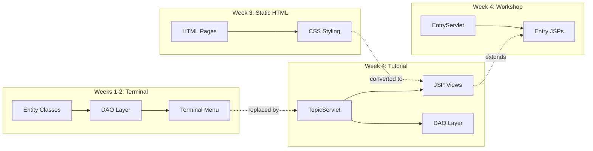
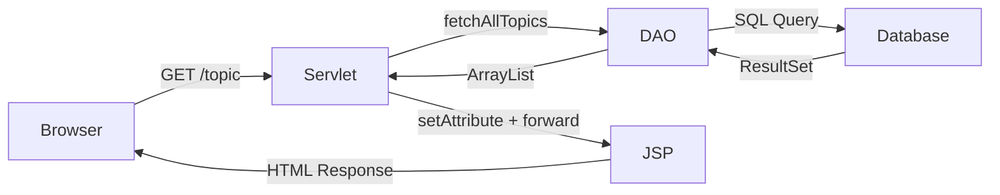
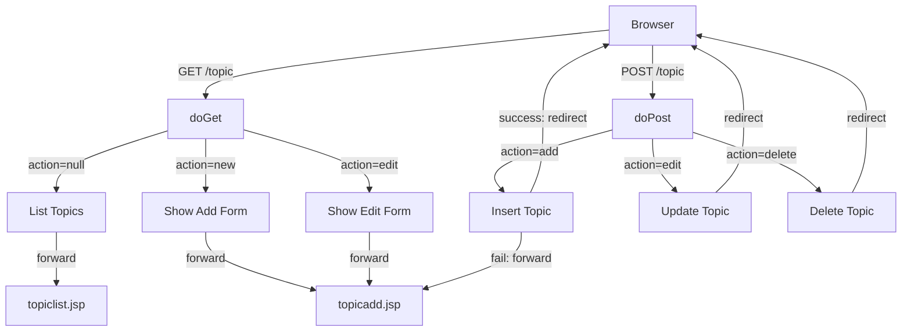
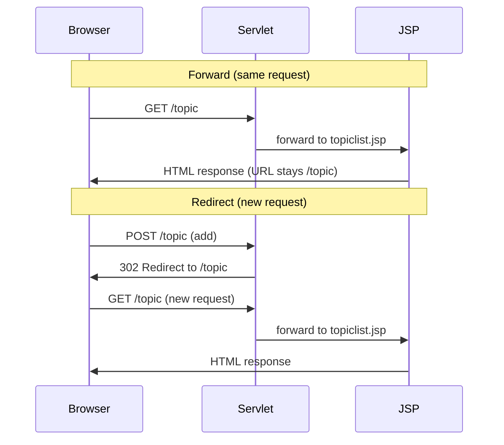

# Learning Logs Web — Tutorial

## Week 4 — Tutorial: JSP & Servlets

> **From static to dynamic — your pages come alive.**

---

## Why This Week Matters

In Weeks 1–2, you built a Java backend with entities, DAOs, and a terminal menu. In Week 3, you gave it a face with HTML pages and CSS styling. Now in Week 4, you **connect them** — your servlet handles requests, talks to the database, and forwards data to JSP pages that render it dynamically.

This tutorial introduces the **web application layer** that bridges your Java backend to the browser:

| What You Know (Weeks 1-3) | What's New (Week 4) |
|---------------------------|---------------------|
| Java entities + DAOs | **Servlet** — Java class that handles HTTP requests |
| Static HTML pages | **JSP** — HTML that can run Java/EL expressions |
| Hardcoded content | **JSTL** — `<c:forEach>`, `<c:if>` for dynamic rendering |
| `href="#"` placeholder links | **EL** — `${topic.name}` calls `getName()` automatically |
| Open HTML files in browser | **Tomcat** — web server that runs your WAR |
| `main()` runs the app | **`@WebServlet`** maps URLs to Java classes |



---

## What's Already Done

These files are **provided and complete** — no changes needed:

| Layer | Files | From |
|-------|-------|------|
| Entity | `Topic.java`, `Entry.java` | Week 2 (Entry updated with title, link, image) |
| DAO | `TopicDao.java`, `TopicDaoImpl.java`, `EntryDao.java`, `EntryDaoImpl.java` | Week 2 |
| Database | `DatabaseConnection.java` | Week 2 (updated — see [why it changed](#why-databaseconnectionjava-changed-from-week-2)) |
| CSS | `main.css`, `topic-list.css`, `topic-add.css` | Week 3 |
| Database Schema | `sql/learninglog.sql`, `sql/seed.sql` | Week 2 (updated) |
| Config | `pom.xml`, `web.xml`, `.gitignore` | New for Week 4 |

---

## What You'll Build

| File | What It Does |
|------|-------------|
| `TopicServlet.java` | Handles all topic HTTP requests (list, add, edit, delete) |
| `topiclist.jsp` | Displays topics dynamically using JSTL forEach + EL |
| `topicadd.jsp` | Add/edit form with error handling using JSTL + EL |
| `TopicDao.java` | Add 3 new method signatures (findById, update, delete) |
| `TopicDaoImpl.java` | Implement the 3 new DAO methods |

---

## Architecture

### How a Request Flows

When you visit `http://localhost:8080/learning-logs/`, here's what happens step by step:

**1. `web.xml` catches the root URL**

```xml
<welcome-file>topic</welcome-file>
```

Tomcat sees `/learning-logs/` (no specific page) and forwards internally to `/learning-logs/topic`.

**2. `@WebServlet("/topic")` matches the URL**

Tomcat finds `TopicServlet` because its annotation matches `/topic`. Since the browser is visiting a page (not submitting a form), it's a **GET** request → Tomcat calls `doGet()`.

**3. `doGet()` checks the `action` parameter**

```java
String action = request.getParameter("action");  // reads ?action=xxx from URL
```

The URL is just `/topic` with no `?action=...`, so `action` is `null`.

**4. `action == null` → fetch and display topics**

```java
if (action == null) {
    ArrayList<Topic> topics = topicDao.fetchAllTopics();  // SQL: SELECT * FROM topics
    request.setAttribute("topics", topics);                // attach list to request
    request.getRequestDispatcher("/WEB-INF/views/topiclist.jsp")
           .forward(request, response);                    // hand off to JSP
}
```

- `fetchAllTopics()` → DAO runs the SQL query, returns 5 topics
- `setAttribute("topics", topics)` → attaches the list to the request so the JSP can read it via `${topics}`
- `getRequestDispatcher(path)` → gets a dispatcher that knows where the JSP is. JSPs inside `WEB-INF/` cannot be accessed directly by the browser — only server-side code can reach them through the dispatcher
- `.forward(request, response)` → hands off the request **completely** to the JSP. The servlet is done — the JSP takes over, renders HTML, and sends the response. The browser URL stays `/topic`

> **`forward()` vs `include()`:** `forward()` transfers control completely — code after it does not run. `include()` temporarily inserts a JSP's output and returns control back to the servlet. We use `forward()` because our JSPs are complete pages, not reusable fragments.

**5. JSP renders HTML**

The JSP reads `${topics}` via EL, loops with `<c:forEach>`, and outputs plain HTML. The browser receives only HTML — no Java code visible.



### How Different Actions Are Routed

All topic requests go to the **same servlet** (`/topic`). The `action` parameter decides what happens:

| URL / Form | `action` value | Method | What Happens |
|-----------|---------------|--------|-------------|
| `/topic` | `null` | GET | Fetch all topics → forward to `topiclist.jsp` |
| `/topic?action=new` | `"new"` | GET | Forward to empty `topicadd.jsp` form |
| `/topic?action=edit&topicid=1` | `"edit"` | GET | Find topic #1 → forward to pre-filled form |
| Form submit with `action=add` | `"add"` | POST | Validate → insert → redirect to `/topic` |
| Form submit with `action=edit` | `"edit"` | POST | Validate → update → redirect to `/topic` |
| Form submit with `action=delete` | `"delete"` | POST | Delete topic → redirect to `/topic` |

> **Pattern:** GET requests **forward** to a JSP (show a page). POST requests **redirect** back to the list after success (Post-Redirect-Get pattern).

### GET vs POST Flow



### Forward vs Redirect



---

## Project Structure

```
learning-logs-web-jsp-tutorial/
├── pom.xml                                    WAR packaging + Jakarta EE deps
├── sql/
│   ├── learninglog.sql                        Database schema
│   └── seed.sql                               Sample data
├── references/                                14 video summary guides
├── wireframes/                                UI reference images
├── src/main/
│   ├── java/com/learninglogs/
│   │   ├── controller/
│   │   │   └── TopicServlet.java              ★ TODOs 7-12
│   │   ├── entity/
│   │   │   ├── Topic.java                     Provided
│   │   │   └── Entry.java                     Provided (updated)
│   │   ├── dao/
│   │   │   ├── TopicDao.java                  ★ TODO 13
│   │   │   ├── TopicDaoImpl.java              ★ TODO 14
│   │   │   ├── EntryDao.java                  Provided
│   │   │   └── EntryDaoImpl.java              Provided
│   │   └── utils/
│   │       └── DatabaseConnection.java        Provided
│   └── webapp/
│       ├── static/
│       │   ├── css/                           Provided (from Week 3)
│       │   ├── images/book.png                Provided
│       │   └── js/                            Empty (future use)
│       └── WEB-INF/
│           ├── views/
│           │   ├── topiclist.jsp               ★ TODOs 1-3
│           │   └── topicadd.jsp                ★ TODOs 4-6
│           └── web.xml                        Provided
```

---

## TODO List

### JSP — Topic List Page (`WEB-INF/views/topiclist.jsp`)

| # | Title | What You Build |
|---|-------|---------------|
| 1 | JSP Directives | `<%@ page %>` + `<%@ taglib %>` |
| 2 | Head + Header + Navbar | `<head>` with contextPath CSS, header, navbar with "+New Topic" link |
| 3 | Dynamic Content | Search bar + `<c:forEach>` topic loop with edit/delete |

### JSP — Topic Add/Edit Page (`WEB-INF/views/topicadd.jsp`)

| # | Title | What You Build |
|---|-------|---------------|
| 4 | JSP Directives | `<%@ page %>` + `<%@ taglib %>` |
| 5 | Head + Header + Navbar | CSS links, EL ternary for Add/Edit title |
| 6 | Form Content | `<c:if>` error display, hidden inputs, EL value binding |

### Java — Topic Servlet (`controller/TopicServlet.java`)

| # | Title | What You Build |
|---|-------|---------------|
| 7 | Servlet Class + doGet | `@WebServlet`, HttpServlet, DAO field, doGet skeleton |
| 8 | List Topics | fetchAllTopics, setAttribute, forward to topiclist.jsp |
| 9 | Show Add/Edit Form | action=new: forward. action=edit: findById + forward |
| 10 | Add Topic (doPost) | Validate, insertTopic, redirect/forward |
| 11 | Edit Topic (doPost) | Parse topicid, validate, updateTopic, redirect |
| 12 | Delete Topic (doPost) | Parse topicid, deleteTopic, redirect |

### Java — DAO Updates (`dao/TopicDao.java` + `TopicDaoImpl.java`)

| # | Title | What You Build |
|---|-------|---------------|
| 13 | New DAO Signatures | findTopicById, updateTopic, deleteTopic |
| 14 | New DAO Methods | Implement findById, update, delete with JDBC |

---

## Key Concepts

### What Changed from Week 3

| Week 3 (HTML) | Week 4 (JSP + Servlet) |
|---------------|----------------------|
| `.html` files in `pages/` | `.jsp` files in `WEB-INF/views/` |
| Static hardcoded content | Dynamic content from database via EL |
| `href="../static/css/main.css"` | `href="${pageContext.request.contextPath}/static/css/main.css"` |
| `<a href="#">` placeholder links | `<a href="${pageContext.request.contextPath}/topic?action=new">` |
| `<form action="">` empty | `<form action="${pageContext.request.contextPath}/topic" method="post">` |
| No server processing | `TopicServlet` handles GET and POST requests |
| Right-click → Open in Browser | `mvn clean package cargo:run` → Tomcat serves pages |

### Why JSP Files Live in `WEB-INF/views/`

In Week 3, HTML files were in `pages/` — accessible directly by URL. JSP files go inside `WEB-INF/` which is **protected** — the browser cannot access them directly. Only the servlet can forward to them. This ensures every request goes through your servlet first (for security and data loading).

```
Week 3:  Browser → pages/topic-list.html        (direct access)
Week 4:  Browser → Servlet → WEB-INF/views/topiclist.jsp  (servlet controls access)
```

### Servlet Essentials

- **`@WebServlet("/topic")`** — Maps this class to the URL `/topic`
- **`doGet()`** — Handles GET requests (viewing pages, clicking links)
- **`doPost()`** — Handles POST requests (form submissions that change data)
- **`request.getParameter("action")`** — Reads URL or form parameters
- **`request.setAttribute("topics", list)`** — Passes data to JSP
- **`request.getRequestDispatcher("path").forward(req, res)`** — Server-side forward (URL doesn't change)
- **`response.sendRedirect("url")`** — Client-side redirect (new request, URL changes)

### JSP + JSTL + EL

- **`<%@ page %>`** — Page directive (content type, encoding)
- **`<%@ taglib prefix="c" uri="jakarta.tags.core" %>`** — Imports JSTL core tags
- **`<c:forEach var="topic" items="${topics}">`** — Loops over a list (like Java for-each)
- **`<c:if test="${not empty error}">`** — Conditional rendering
- **`${topic.name}`** — EL expression, calls `topic.getName()` automatically
- **`${empty topic ? 'Add' : 'Edit'}`** — EL ternary operator
- **`${pageContext.request.contextPath}`** — Your app's base URL (returns `/learning-logs`)

> **Where does `pageContext` come from?** It's a JSP **implicit object** — available automatically in every JSP page without any import or declaration. `pageContext.request` is the same `HttpServletRequest` the servlet forwarded, and `.contextPath` is your app's deploy path. This ensures links and form actions always point to the correct URL, even if the app is deployed under a different name.

### Forward vs Redirect

| | Forward | Redirect |
|---|---------|----------|
| Request | Same request | New request |
| URL | Doesn't change | Changes |
| Data | Attributes preserved | Attributes lost |
| Use for | Showing pages/errors | After successful changes |
| Pattern | Display data | Post-Redirect-Get |

### Why Redirect After POST? (Post-Redirect-Get)

After a successful form submission (add/edit/delete), the servlet **redirects** instead of forwarding. This prevents the "resubmit form?" popup if the user refreshes the page.

```
Without redirect (bad):
  POST /topic (add "Python") → forward → topiclist.jsp
  User hits F5 → "Resubmit form data?" → adds "Python" again!

With redirect (good):
  POST /topic (add "Python") → redirect → GET /topic → topiclist.jsp
  User hits F5 → just refreshes the list (safe)
```

---

## What Changed in `pom.xml`

In Weeks 1–3, the project was a **standalone Java app** — it had a `main()` method and ran with `exec-maven-plugin`. Now it's a **web application** deployed to Tomcat, so `pom.xml` changes significantly.

### Packaging

```xml
<!-- Week 3: default JAR (standalone app) -->
<packaging>jar</packaging>   <!-- implicit, not written -->

<!-- Week 4: WAR (web archive for Tomcat) -->
<packaging>war</packaging>
```

A `.war` file is like a `.jar` but structured for web servers. When Maven builds the WAR, it creates this structure inside it:

```
learning-logs.war (built by Maven — you don't create this manually)
├── static/                       Your CSS, images, JS (from webapp/)
├── WEB-INF/
│   ├── classes/                  Your compiled .java files
│   │   └── com/learninglogs/...
│   ├── lib/                      Maven puts dependency JARs here automatically
│   │   ├── mysql-connector-j-9.2.0.jar
│   │   ├── jakarta.servlet.jsp.jstl-3.0.1.jar
│   │   └── ...
│   ├── views/                    Your JSP files
│   │   ├── topiclist.jsp
│   │   └── topicadd.jsp
│   └── web.xml
```

> **Note:** The `WEB-INF/lib/` folder does **not** exist in your source code — you never manage it. Maven reads your `pom.xml` dependencies and bundles the JARs into `WEB-INF/lib/` at build time. This is why you only see dependency JARs inside the built WAR, not in your project folder.

### Dependencies — What Changed from Week 3

| Dependency | Week 3 | Week 4 | Why |
|------------|--------|--------|-----|
| `mysql-connector-j` | Yes | Yes | Same MySQL driver — still connects to `learning_logs` database |
| **`jakarta.servlet-api`** | — | **New** (`provided`) | Provides `HttpServlet`, `@WebServlet`, `HttpServletRequest` |
| **`jakarta.servlet.jsp-api`** | — | **New** (`provided`) | JSP compilation support |
| **`jakarta.servlet.jsp.jstl-api`** | — | **New** | JSTL tags: `<c:forEach>`, `<c:if>` |
| **`jakarta.servlet.jsp.jstl`** | — | **New** | JSTL implementation (Glassfish) — the actual runtime |

> **What does `provided` mean?** Think of it like packing a suitcase for a hotel stay. Regular dependencies (like `mysql-connector-j`) are things the hotel doesn't have — you must pack them yourself (Maven puts them in `WEB-INF/lib/`). But `provided` dependencies (like `jakarta.servlet-api`) are things the hotel already has — towels, soap. You need to know their size while packing (compilation), but you don't bring them — the hotel provides them when you arrive (runtime). If you packed your own towels AND the hotel gave you towels, you'd have two conflicting sets — same thing happens with duplicate JARs on the classpath.

### Plugins — What Changed from Week 3

| Plugin | Week 3 | Week 4 | What It Does |
|--------|--------|--------|-------------|
| `exec-maven-plugin` | Yes | **Removed** | Week 3: ran `main()`. Week 4: no `main()` in a web app |
| **`maven-war-plugin`** | — | **New** | Packages the project as a `.war` file |
| **`cargo-maven3-plugin`** | — | **New** | Downloads and runs Tomcat 10.1 automatically |

### No Separate Tomcat Install Needed

XAMPP provides **MySQL only** for this project — it does not include Tomcat. Instead of downloading and configuring Tomcat separately, the **Cargo Maven plugin** handles everything:

```
mvn clean package cargo:run
```

This single command:
1. **Compiles** your Java code
2. **Packages** everything into a `.war` file
3. **Downloads** Tomcat 10.1 automatically (first run only, cached in `target/`)
4. **Deploys** your WAR to the downloaded Tomcat
5. **Starts** the server at `http://localhost:8080/learning-logs/`

> **Why Tomcat 10.x?** Jakarta EE (the `jakarta.*` package namespace) requires Tomcat 10+. Older Tomcat versions (9 and below) use the `javax.*` namespace and won't work with our dependencies.

---

## Getting Started

### Prerequisites

- **XAMPP** running (MySQL only — for the database)
- **IntelliJ IDEA Ultimate** (has built-in JSP, JSTL, and Servlet support)
- **Java 25** installed

### Step 1: Setup Database

> **Note:** You already have the `learning_logs` database from Week 2. Running the updated SQL below will **drop and recreate** the tables (the `entries` table now has new columns: `title`, `link`, `image`). Any data you added previously will be replaced with fresh sample data.

1. Start **MySQL** in XAMPP (same as Week 2)
2. Open **phpMyAdmin** (`http://localhost/phpmyadmin`)
3. Click the `learning_logs` database on the left sidebar
4. Click the **Import** tab at the top
5. Click **Choose File** and select `sql/learninglog.sql` from the project — click **Import**
6. Click the **Import** tab again, choose `sql/seed.sql` — click **Import**

### Step 2: Open the Project

Open this project in **IntelliJ IDEA** (File → Open → select the project folder).

### Step 3: Study the Provided Files

Before writing code, understand the patterns:

- **`DatabaseConnection.java`** — Same as Week 2, but with a `static` block to load the MySQL driver ([why?](#why-databaseconnectionjava-changed-from-week-2))
- **`TopicDao.java` + `TopicDaoImpl.java`** — You know these from Week 2. You'll add 3 new methods
- **`main.css`, `topic-list.css`, `topic-add.css`** — Your Week 3 CSS, ready to use
- **`web.xml`** — Configures the welcome page (points to `/topic`)
- **`pom.xml`** — WAR packaging, Jakarta EE dependencies, and Cargo plugin (auto-downloads Tomcat)

### Step 4: Complete the TODOs

Work through the TODOs in order. Each TODO comment block contains the complete code you need to write:

1. **TODOs 1-6** — JSP pages (`topiclist.jsp` + `topicadd.jsp`)
2. **TODOs 7-12** — Servlet (`TopicServlet.java`)
3. **TODOs 13-14** — DAO methods (`TopicDao.java` + `TopicDaoImpl.java`)

### Step 5: Build and Run

Run from terminal or IntelliJ's Maven panel:
```
mvn clean package cargo:run
```

- First run downloads Tomcat automatically (~30 seconds)
- Wait for: `Tomcat 10.x Embedded is started`
- Visit `http://localhost:8080/learning-logs/`
- Press `Ctrl+C` to stop the server

### Step 6: How to Preview

Unlike Week 3 where you could right-click HTML files to open in browser, JSP files **must** be served through Tomcat. The servlet processes the request and forwards to the JSP — opening a `.jsp` file directly won't work.

> **Note:** Every time you change Java code, stop the server (`Ctrl+C`) and run `mvn clean package cargo:run` again. CSS and JSP changes may not require a restart.

---

## Expected Output

### Topic List Page (`/learning-logs/topic`)

| Section | Left | Center | Right |
|---------|------|--------|-------|
| **HEADER** | Logo + Learning Log | | Username + Logout |
| **NAVBAR** | (empty) | Topic Lists | +New Topic |
| **SEARCH** | | Topic: [________] [SEARCH] | |
| **LIST** | 1. Python | Edit | Delete |
| | 2. Web Development | Edit | Delete |
| | 3. Data Science | Edit | Delete |
| | 4. Machine Learning | Edit | Delete |
| | 5. Cybersecurity | Edit | Delete |
| **FOOTER** | | &copy; Learning Logs | |

### Add Topic Page (`/learning-logs/topic?action=new`)

| Section | Left | Center | Right |
|---------|------|--------|-------|
| **HEADER** | Logo + Learning Log | | Username + Logout |
| **NAVBAR** | < Back (Topics) | Add New Topic | |
| **FORM** | | Topic: [________________] | |
| | | [Save] | |
| **FOOTER** | | &copy; Learning Logs | |

### Edit Topic Page (`/learning-logs/topic?action=edit&topicid=1`)

| Section | Left | Center | Right |
|---------|------|--------|-------|
| **HEADER** | Logo + Learning Log | | Username + Logout |
| **NAVBAR** | < Back (Topics) | Edit Topic | |
| **FORM** | | Topic: [__Python______] | |
| | | [Save] | |
| **FOOTER** | | &copy; Learning Logs | |

---

## Test Cases

| # | Action | Expected Result |
|---|--------|-----------------|
| 1 | Visit `http://localhost:8080/learning-logs/` | Redirects to topic list, shows 5 seeded topics |
| 2 | Check CSS styling | Page matches Week 3 topic list appearance (header, navbar, footer) |
| 3 | Click "+New Topic" | Shows add form with empty input, navbar says "Add New Topic" |
| 4 | Submit empty topic name | Error: "Topic name cannot be empty." — stays on form |
| 5 | Add topic "JavaScript" | Redirects to list, "JavaScript" appears as topic #6 |
| 6 | Add duplicate "Python" | Error: "Topic already exists." — stays on form |
| 7 | Click "Edit" on Python | Shows edit form, input pre-filled with "Python", navbar says "Edit Topic" |
| 8 | Change "Python" to "Python 3" and save | Redirects to list, topic now shows "Python 3" |
| 9 | Edit topic with empty name | Error: "Topic name cannot be empty." — stays on form |
| 10 | Click "Delete" on a topic | Confirm dialog appears: "Are you sure you want to delete?" |
| 11 | Confirm delete | Topic removed from list, remaining topics renumber |
| 12 | Click logo (book icon) | Navigates back to topic list |
| 13 | Check URL after adding topic | URL is `/learning-logs/topic` (redirect, not `/topic?action=add`) |
| 14 | Refresh page after adding | No "resubmit form?" dialog (Post-Redirect-Get works) |
| 15 | View page source in browser | No Java code visible — only rendered HTML |

---

## Progress Tracker

Check off each task as you complete it:

### JSP Pages
- [ ] **TODO 1** — topiclist.jsp: Page directive + JSTL taglib directive
- [ ] **TODO 2** — topiclist.jsp: Head with contextPath CSS + header + navbar
- [ ] **TODO 3** — topiclist.jsp: Search bar + `<c:forEach>` topic loop
- [ ] **TODO 4** — topicadd.jsp: Page directive + JSTL taglib directive
- [ ] **TODO 5** — topicadd.jsp: Head with contextPath CSS + header + navbar (EL ternary)
- [ ] **TODO 6** — topicadd.jsp: Error display + form with hidden inputs + EL value binding

### Servlet
- [ ] **TODO 7** — TopicServlet: `@WebServlet`, class declaration, DAO field, doGet skeleton
- [ ] **TODO 8** — TopicServlet: List topics (fetchAll → setAttribute → forward)
- [ ] **TODO 9** — TopicServlet: Show add/edit form (action routing + findById)
- [ ] **TODO 10** — TopicServlet: Add topic (validate → insert → redirect/forward)
- [ ] **TODO 11** — TopicServlet: Edit topic (parse id → validate → update → redirect)
- [ ] **TODO 12** — TopicServlet: Delete topic (parse id → delete → redirect)

### DAO
- [ ] **TODO 13** — TopicDao: Add findTopicById, updateTopic, deleteTopic signatures
- [ ] **TODO 14** — TopicDaoImpl: Implement findById, update, delete with PreparedStatement

### Final Checks
- [ ] `mvn clean package` builds without errors
- [ ] `mvn clean package cargo:run` starts Tomcat successfully
- [ ] Topic list displays 5 seeded topics with correct CSS
- [ ] Add topic works (valid name → redirect, empty/duplicate → error)
- [ ] Edit topic pre-fills the form and saves changes
- [ ] Delete topic shows confirm dialog and removes the topic
- [ ] URL stays `/topic` after forward (list page, add form)
- [ ] URL changes to `/topic` after redirect (successful add/edit/delete)
- [ ] No "resubmit form?" on refresh after POST operations

---

## Troubleshooting

| Problem | Cause | Fix |
|---------|-------|-----|
| 404 Not Found | WAR not deployed or wrong URL | Run `mvn clean package cargo:run`, visit `/learning-logs/` |
| 500 Internal Server Error | Java exception in servlet | Check terminal output for stack trace |
| ClassNotFoundException: JSTL | JSTL not in WAR | Run `mvn clean package` and check that JSTL dependencies are in `pom.xml` — Maven bundles them into the WAR's `WEB-INF/lib/` automatically |
| CSS not loading | Wrong contextPath | Check `${pageContext.request.contextPath}` in CSS links |
| Empty topic list | Database not set up | Run `sql/learninglog.sql` + `sql/seed.sql` in phpMyAdmin |
| No suitable driver found | MySQL driver not loaded by Tomcat | Already fixed — see [why it changed](#why-databaseconnectionjava-changed-from-week-2) |
| 405 Method Not Allowed | Missing doPost/doGet | Make sure both methods are implemented in the servlet |
| Form data not received | Missing `name` attribute | Check `<input name="topic">` has the name attribute |
| JSP shows `${topic.name}` as text | Missing taglib directive | Add `<%@ taglib prefix="c" uri="jakarta.tags.core" %>` |
| "Resubmit form?" on refresh | Used forward instead of redirect after POST | Use `response.sendRedirect()` after successful add/edit/delete |

### Why `DatabaseConnection.java` Changed from Week 2

In Week 2, your app ran as a **standalone Java program** (`main()` method). Java's `ServiceLoader` automatically discovered the MySQL JDBC driver from the JAR on the classpath — `DriverManager.getConnection()` just worked.

In Week 4, your app runs inside **Tomcat** (a web server). Tomcat uses its own classloader, which **does not** auto-discover JDBC drivers bundled in your WAR's `WEB-INF/lib/`. Without the driver being loaded, `DriverManager` has no idea how to connect to MySQL.

**Week 2 (worked without driver loading):**
```java
public static Connection getConnection() throws SQLException {
    return DriverManager.getConnection(DB_URL, DB_USER, DB_PASSWORD);
}
```

**Week 4 (added static block to load the driver explicitly):**
```java
static {
    try {
        Class.forName("com.mysql.cj.jdbc.Driver");
    } catch (ClassNotFoundException e) {
        System.out.println("MySQL Driver not found: " + e.getMessage());
    }
}

public static Connection getConnection() throws SQLException {
    return DriverManager.getConnection(DB_URL, DB_USER, DB_PASSWORD);
}
```

`Class.forName("com.mysql.cj.jdbc.Driver")` forces Java to load the driver class, which registers itself with `DriverManager`. The `static` block runs once when the class is first used — before any `getConnection()` call.

---

## References

The `references/` folder contains 14 guides covering servlet and JSP concepts:

| # | Topic |
|---|-------|
| 01 | Introduction to Servlets |
| 02 | Creating and Running Servlets |
| 03 | Servlet Lifecycle |
| 04 | web.xml Deployment Descriptor |
| 05 | Request and Response |
| 06 | GET vs POST |
| 07 | Forward, Redirect, and Include |
| 08 | Sessions |
| 09 | Introduction to JSP |
| 10 | JSP Lifecycle |
| 11 | JSP Tags Overview |
| 12 | JSP Scripting Tags |
| 13 | JSP Implicit Objects |
| 14 | Expression Language (EL) |

---

*Informatics College Pokhara — Java Programming By Sandesh Hamal*
