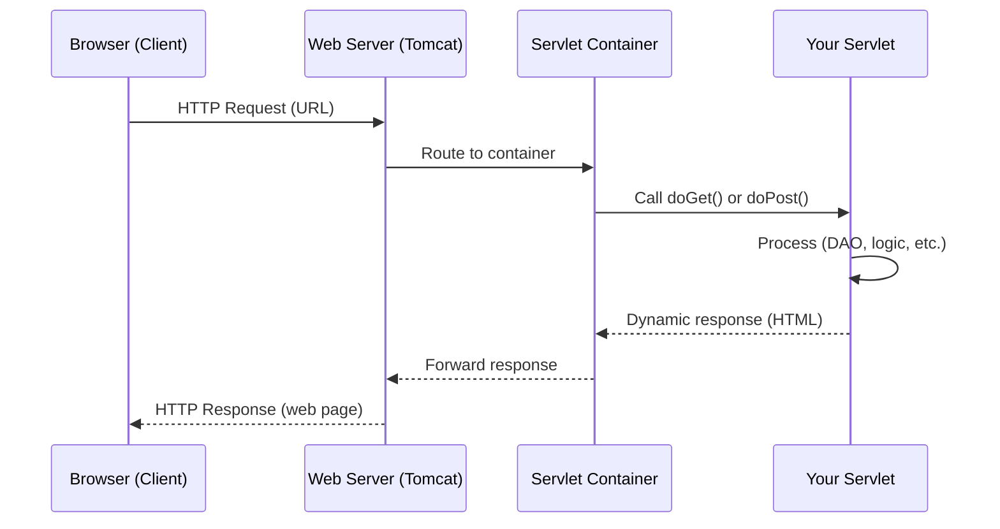
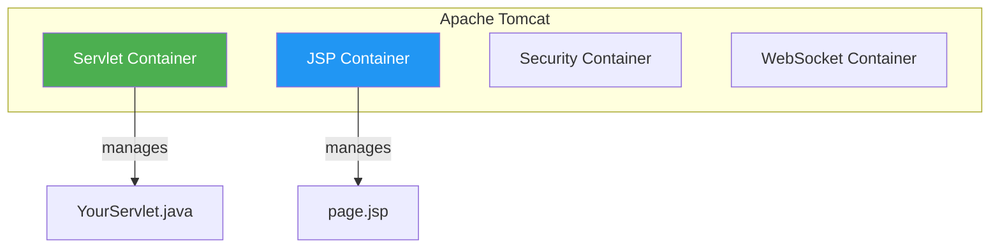

# Introduction to Servlets

### What Are Servlets and Why Do We Need Them?

> *"The browser asks, the servlet answers — that's the entire web in one sentence."*

---

## What Is a Servlet?

A **Servlet** is a server-side Java class that does three things:

1. **Handles** a client request (from a browser)
2. **Processes** it (runs Java logic)
3. **Generates** a dynamic response (sends back HTML, JSON, etc.)

Think of it as the replacement for your terminal menu — instead of `Scanner` reading keyboard input, a servlet reads **HTTP requests** from the browser.

| Terminal App (Weeks 1-2) | Servlet (Week 4) |
|--------------------------|------------------|
| `Scanner` reads input | `request.getParameter()` reads form data |
| `System.out.println()` writes output | JSP generates HTML response |
| Runs on your machine | Runs on a web server (Tomcat) |
| One user at a time | Many users at once |

---

## Client-Server Basics

| Term | What It Means |
|------|---------------|
| **Client** | The web browser (Chrome, Firefox, etc.) that sends requests |
| **Server** | The remote machine + software that handles requests and sends back responses |

### Two Types of Server

| | Web Server | Application Server |
|--|-----------|-------------------|
| **Purpose** | Serves web content over HTTP | Full business logic + enterprise services |
| **Examples** | Tomcat, GlassFish, Jetty | JBoss, IBM WebSphere, WildFly |
| **Supports** | Servlets, JSP | Servlets, JSP, EJB, JMS, JPA and more |
| **Weight** | Lightweight | Heavyweight |
| **Use case** | Simple web apps (like ours) | Large enterprise systems |

> **For this module**, we use **Apache Tomcat** (via XAMPP) — a web server. It has everything we need: a servlet container and a JSP container.

---

## The Servlet Container

Tomcat doesn't just run your servlet directly — it has a **servlet container** that manages everything for you.

### What the Servlet Container Does

| Responsibility | Description |
|---------------|-------------|
| **Lifecycle management** | Creates, initializes, and destroys servlet instances |
| **Request routing** | Checks which servlet should handle each URL |
| **Request processing** | Calls the right method (`doGet`, `doPost`) on your servlet |
| **Response delivery** | Sends the servlet's output back to the browser |
| **Thread management** | Handles multiple requests at the same time |

You don't manage any of this yourself — you just write the servlet class and the container runs it.

---

## Why Use Servlets?

Static HTML pages (like the ones you built in Week 3) always show the **same content**. But real apps need to:

- Show **different data** for different users (e.g., "your topics")
- **Read from a database** and display results
- **Process form submissions** (add, edit, delete)
- **Redirect** users after actions

Servlets make this possible by running **Java code on the server** before sending a response.

| Static Page (Week 3) | Dynamic Page with Servlets (Week 4) |
|----------------------|-------------------------------------|
| Same content every time | Content changes based on database |
| Hardcoded topic names | Topics loaded from MySQL |
| Form `action=""` (empty) | Form posts to a servlet endpoint |
| No server processing | Java logic runs before page loads |

---

## Request-Response Flow — Step by Step

| Step | What Happens | Example |
|------|-------------|---------|
| 1. Client sends request | User types URL or clicks a link | `localhost:8081/learning-logs/topic` |
| 2. Server receives request | Tomcat accepts the HTTP request | Tomcat listening on port 8081 |
| 3. Container routes request | Servlet container finds the matching `@WebServlet` | `@WebServlet("/topic")` maps to `TopicServlet` |
| 4. Servlet processes request | Your Java code runs — DAO calls, logic, etc. | `topicDao.fetchAllTopics()` |
| 5. Response generated | Servlet forwards to JSP or sends redirect | `request.getRequestDispatcher("topiclist.jsp")` |
| 6. Response sent to client | Browser receives HTML and renders the page | User sees the topic list |

---

## Other Server-Side Technologies

Servlets are one of many server-side technologies. Here's how they relate:

| Technology | Language | Relationship to Servlets |
|-----------|----------|------------------------|
| **JSP** (JavaServer Pages) | Java | Built on top of servlets — compiled into servlets by the container |
| **Spring / Spring Boot** | Java | Framework that simplifies servlet-based development |
| **JSF** (JavaServer Faces) | Java | Component-based UI framework using servlets |
| **PHP** | PHP | Different language, same concept (server-side processing) |
| **Django / Flask** | Python | Same concept in Python |

We start with **Servlets + JSP** to understand the fundamentals before frameworks.

---

## Key Takeaways

- A **servlet** is a Java class that handles HTTP requests and generates dynamic responses
- The **servlet container** (inside Tomcat) manages your servlet's lifecycle — you just write the code
- The **client** (browser) sends requests; the **server** processes them and sends responses
- Servlets replace your terminal menu — same DAO layer, but now accessed via the browser
- This is the foundation for all Java web frameworks (Spring, JSF, etc.)

