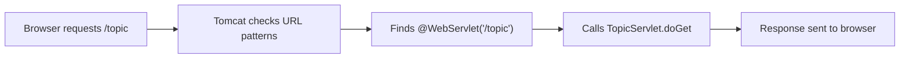
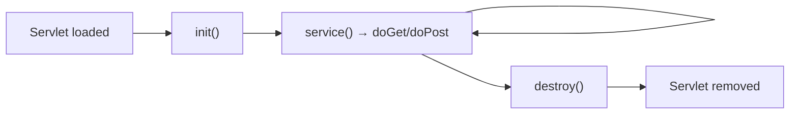

# Creating and Running Servlets

### Servlet Types, HttpServlet, and Your First Servlet

> *"Three ways to create a servlet — but in practice, you'll only ever use one."*

---

## Three Ways to Create a Servlet


| Approach | What You Extend/Implement | When to Use | Used in Practice? |
|----------|--------------------------|-------------|-------------------|
| `implements Servlet` | `Servlet` interface | Need full manual control of lifecycle | Rarely |
| `extends GenericServlet` | `GenericServlet` class | Protocol-independent servlet (non-HTTP) | Sometimes |
| `extends HttpServlet` | `HttpServlet` class | HTTP web applications | **Almost always** |

**We use `HttpServlet`** — it gives us `doGet()`, `doPost()`, and access to `HttpServletRequest` / `HttpServletResponse`.

---

## The Servlet Class Hierarchy

Each level in the hierarchy adds more functionality:

| Level | Type | What It Provides |
|-------|------|-----------------|
| `Servlet` | Interface | Lifecycle methods: `init()`, `service()`, `destroy()` |
| `GenericServlet` | Abstract class | Implements `Servlet` + `ServletConfig` — generic request handling |
| `HttpServlet` | Class | Adds HTTP methods: `doGet()`, `doPost()`, `doDelete()`, etc. |

Your servlet extends `HttpServlet`, which means it **inherits everything** from the levels above.

---

## Creating a Servlet — Step by Step

### Step 1: Create a class that extends `HttpServlet`

```java
package com.learninglogs.controller;

import jakarta.servlet.http.HttpServlet;
import jakarta.servlet.http.HttpServletRequest;
import jakarta.servlet.http.HttpServletResponse;
import java.io.IOException;

public class TopicServlet extends HttpServlet {
    // your code goes here
}
```

### Step 2: Override the HTTP method you need

```java
@Override
protected void doGet(HttpServletRequest request, HttpServletResponse response)
        throws IOException {
    // runs when browser sends a GET request
}

@Override
protected void doPost(HttpServletRequest request, HttpServletResponse response)
        throws IOException {
    // runs when a form sends a POST request
}
```

### Step 3: Map the servlet to a URL

**Modern approach — `@WebServlet` annotation (what we use):**

```java
@WebServlet("/topic")
public class TopicServlet extends HttpServlet {
    // ...
}
```

**Old approach — `web.xml` (you may see this in tutorials):**

```xml
<servlet>
    <servlet-name>TopicServlet</servlet-name>
    <servlet-class>com.learninglogs.controller.TopicServlet</servlet-class>
</servlet>

<servlet-mapping>
    <servlet-name>TopicServlet</servlet-name>
    <url-pattern>/topic</url-pattern>
</servlet-mapping>
```

> Both approaches do the same thing — map a URL to a servlet class. We use `@WebServlet` because it keeps the mapping next to the code.

---

## How URL Mapping Works

When you type `http://localhost:8081/learning-logs/topic` in the browser:



| URL Part | What It Means |
|----------|--------------|
| `localhost:8081` | Your Tomcat server |
| `/learning-logs` | The application context path (your project name) |
| `/topic` | The servlet URL pattern — mapped to `TopicServlet` |

---

## Sending a Response to the Browser

The simplest way to send output back:

```java
@Override
protected void doGet(HttpServletRequest request, HttpServletResponse response)
        throws IOException {
    PrintWriter out = response.getWriter();
    out.print("<h1>Hello from TopicServlet!</h1>");
}
```

This writes HTML directly from Java — it works, but it's messy for full pages. That's why we use **JSP** for the view and keep servlets for logic only.

---

## Servlet Lifecycle Methods

These are called automatically by the **servlet container** — you don't call them yourself:

| Method | When It Runs | How Many Times |
|--------|-------------|----------------|
| `init()` | When the servlet is first loaded | Once |
| `service()` | On every request (routes to `doGet`/`doPost`) | Every request |
| `destroy()` | When the server shuts down or the servlet is unloaded | Once |



> You rarely override `init()` or `destroy()` — just `doGet()` and `doPost()`.

---

## `@WebServlet` vs `web.xml` — Which One?

| | `@WebServlet` (Annotation) | `web.xml` (Descriptor) |
|--|---------------------------|----------------------|
| **Where** | In the Java class file | In `WEB-INF/web.xml` |
| **Pros** | Mapping lives next to code, less config | Centralised config, can override annotations |
| **Cons** | Spread across files | Verbose XML, easy to forget |
| **We use** | **This one** | Shown for reference only |

---

## Common Errors When Starting Out

| Error | Cause | Fix |
|-------|-------|-----|
| **404 Not Found** | URL pattern doesn't match any servlet | Check `@WebServlet` path matches the URL you're visiting |
| **No valid module found** | Project not configured as a web project | Ensure `<packaging>war</packaging>` in `pom.xml` |
| **ClassNotFoundException** | Servlet class path wrong in `web.xml` | Use fully qualified class name (e.g., `com.learninglogs.controller.TopicServlet`) |

---

## Key Takeaways

- Always extend **`HttpServlet`** — it's the standard for web apps
- Override **`doGet()`** for page loads and **`doPost()`** for form submissions
- Use **`@WebServlet("/path")`** to map URLs to your servlet
- The servlet container calls lifecycle methods automatically — you just write the handler logic
- Writing HTML in Java is possible but ugly — that's what **JSP** is for.
