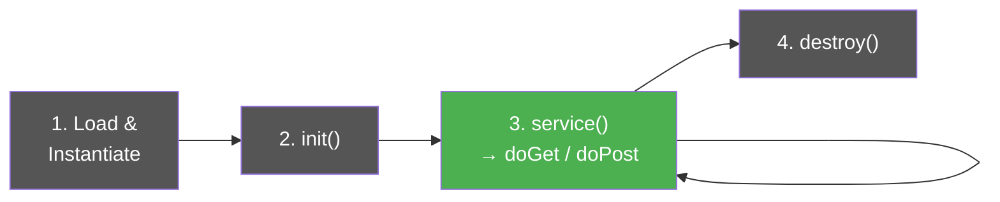
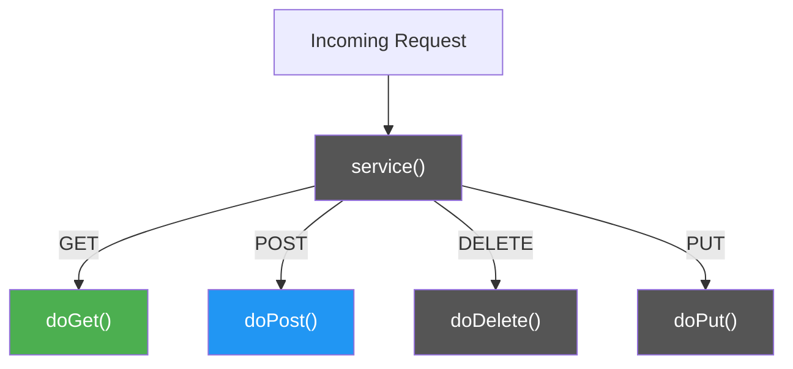

# The Servlet Lifecycle

### How Tomcat Manages Your Servlet

> *"You write the code, Tomcat decides when to create it, run it, and destroy it."*

---

## The Four Stages

Your servlet goes through four stages — and you only need to think about **one** of them most of the time.



| Stage | What Happens | How Often | You Write Code Here? |
|-------|-------------|-----------|---------------------|
| **1. Load & Instantiate** | Tomcat loads your `.class` file and creates one instance | Once (on first request or server start) | No |
| **2. Initialisation** | Tomcat calls `init()` on the instance | Once (right after creation) | Rarely |
| **3. Request Handling** | Tomcat calls `service()`, which routes to `doGet()` or `doPost()` | Every request | **Yes — this is where your code lives** |
| **4. Destruction** | Tomcat calls `destroy()` before removing the servlet | Once (server shutdown) | Rarely |

---

## Stage 1 & 2: Load, Instantiate, Initialise

When Tomcat first needs your servlet (either on startup or the first request):

1. **Loads** the compiled `.class` file into memory
2. **Creates one object** (instance) of your servlet class
3. **Calls `init()`** on that object

This happens **once**. The same object is reused for every request after that.

```java
@Override
public void init() {
    // runs once — use for one-time setup if needed
    // e.g., loading configuration values
    System.out.println("TopicServlet initialised");
}
```

> You rarely need to override `init()`. In our project, the DAO handles its own setup.

---

## Stage 3: Request Handling — The Important One

This is where you spend all your time. For **every** incoming request:

1. Tomcat calls `service()` on your servlet
2. `service()` checks the HTTP method and routes to the right handler



You **never override `service()`** — you override `doGet()` and `doPost()` directly.

| HTTP Method | You Override | Typical Use in Our App |
|-------------|-------------|----------------------|
| **GET** | `doGet()` | Loading pages — show topic list, show add form |
| **POST** | `doPost()` | Form submissions — add topic, update topic |

---

## One Servlet, Many Requests — Multithreading

Tomcat creates **one servlet object** but handles each request in a **separate thread**:

```
Request 1 ──→ Thread 1 ──→ doGet() ──→ Response 1
Request 2 ──→ Thread 2 ──→ doPost() ──→ Response 2
Request 3 ──→ Thread 3 ──→ doGet() ──→ Response 3
         ... all using the SAME servlet object
```

| Concept | What It Means |
|---------|--------------|
| **One instance** | Tomcat only creates your servlet object once |
| **Many threads** | Each request gets its own thread |
| **Shared state is risky** | Don't store request-specific data in instance variables |

> This is why we pass data through `request.setAttribute()` instead of storing it in fields.

---

## Stage 4: Destruction

When Tomcat shuts down:

1. Calls `destroy()` on each servlet
2. Removes the servlet object from memory

```java
@Override
public void destroy() {
    // runs once — cleanup if needed
    System.out.println("TopicServlet destroyed");
}
```

> You rarely need this either. Database connections are managed per-request in our DAO pattern.

---

## Putting It All Together

Here's the full lifecycle mapped to our `TopicServlet`:

| Moment | What Tomcat Does | What Happens in Our App |
|--------|-----------------|------------------------|
| Server starts | Loads `TopicServlet.class`, creates instance, calls `init()` | Servlet ready to receive requests |
| User visits `/topic` | Creates thread, calls `doGet()` | DAO fetches topics from MySQL, forwards to `topiclist.jsp` |
| User submits add form | Creates thread, calls `doPost()` | DAO inserts new topic, redirects back to `/topic` |
| Another user visits `/topic` | Creates another thread, calls `doGet()` again | Same servlet object, new thread |
| Server shuts down | Calls `destroy()`, removes servlet | Cleanup complete |

---

## Key Takeaways

- Tomcat manages the lifecycle — you just override `doGet()` and `doPost()`
- The servlet object is created **once** and reused for all requests
- Each request runs in its own **thread** — don't store request data in instance variables
- `init()` and `destroy()` exist but you rarely need them
- `service()` routes to the right method automatically — never override it directly
