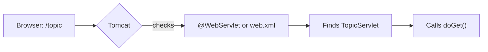

# The web.xml Deployment Descriptor

### What web.xml Does and Why We Don't Use It

> *"web.xml was the old way to wire servlets to URLs — annotations replaced it, but you should know it exists."*

---

## What Is web.xml?

A **deployment descriptor** — an XML file that tells Tomcat which servlet to run for each URL.

```
Client requests /topic  →  Tomcat reads web.xml  →  Finds TopicServlet  →  Runs doGet()
```

It lives inside `WEB-INF/`:

```
src/main/webapp/
├── WEB-INF/
│   └── web.xml       ← deployment descriptor
├── pages/
│   └── topiclist.jsp
```

---

## web.xml vs @WebServlet

| | web.xml (Old Way) | @WebServlet (Our Way) |
|--|-------------------|----------------------|
| **Where** | `WEB-INF/web.xml` | Above your servlet class |
| **Syntax** | XML tags | Single annotation |
| **Mandatory?** | Was required before Servlet 3.0 | Optional — annotation is enough |
| **When to use** | Legacy projects, complex config | Modern projects (like ours) |

**We use `@WebServlet`** — but you'll see `web.xml` in older tutorials and the lecture materials, so here's how it works.

---

## web.xml Syntax

Two tags work together to map a URL to a servlet:

### 1. `<servlet>` — Declares the servlet

```xml
<servlet>
    <servlet-name>TopicServlet</servlet-name>
    <servlet-class>com.learninglogs.controller.TopicServlet</servlet-class>
</servlet>
```

### 2. `<servlet-mapping>` — Maps a URL to that servlet

```xml
<servlet-mapping>
    <servlet-name>TopicServlet</servlet-name>
    <url-pattern>/topic</url-pattern>
</servlet-mapping>
```

The `<servlet-name>` connects the two — it's a logical name (can be anything, but keep it matching the class name for clarity).

### Full example with multiple servlets

```xml
<?xml version="1.0" encoding="UTF-8"?>
<web-app xmlns="https://jakarta.ee/xml/ns/jakartaee" version="6.0">

    <servlet>
        <servlet-name>TopicServlet</servlet-name>
        <servlet-class>com.learninglogs.controller.TopicServlet</servlet-class>
    </servlet>
    <servlet-mapping>
        <servlet-name>TopicServlet</servlet-name>
        <url-pattern>/topic</url-pattern>
    </servlet-mapping>

    <servlet>
        <servlet-name>EntryServlet</servlet-name>
        <servlet-class>com.learninglogs.controller.EntryServlet</servlet-class>
    </servlet>
    <servlet-mapping>
        <servlet-name>EntryServlet</servlet-name>
        <url-pattern>/entry</url-pattern>
    </servlet-mapping>

</web-app>
```

The same thing with annotations — two lines instead of twenty:

```java
@WebServlet("/topic")
public class TopicServlet extends HttpServlet { }

@WebServlet("/entry")
public class EntryServlet extends HttpServlet { }
```

---

## How Tomcat Resolves a Request



| Step | What Happens |
|------|-------------|
| 1 | Browser sends request to `/topic` |
| 2 | Tomcat looks for a matching URL pattern |
| 3 | Checks `@WebServlet` annotations first, then `web.xml` |
| 4 | Finds `TopicServlet`, calls the appropriate method |

---

## Other Things web.xml Can Configure

Even though we don't use it for servlet mapping, `web.xml` can also define:

| Configuration | What It Does |
|--------------|-------------|
| **Welcome file list** | Default page when visiting `/` (e.g., `index.jsp`) |
| **Error pages** | Custom 404 or 500 error pages |
| **Filters** | Code that runs before/after servlets (e.g., authentication) |
| **Listeners** | Code that runs on app startup/shutdown |
| **Session config** | Session timeout settings |

We may use some of these later — but for now, `@WebServlet` is all we need.

---

## Common Errors with web.xml

| Error | Cause | Fix |
|-------|-------|-----|
| **404 Not Found** | `<url-pattern>` doesn't match the URL | Ensure leading `/` is present: `/topic` not `topic` |
| **ClassNotFoundException** | Wrong class name in `<servlet-class>` | Use fully qualified name: `com.learninglogs.controller.TopicServlet` |
| **Duplicate mapping** | Same URL in both `@WebServlet` and `web.xml` | Use one approach, not both |

---

## Key Takeaways

- `web.xml` is the **old way** to map URLs to servlets — we use **`@WebServlet` annotations** instead
- It lives in `WEB-INF/` and uses `<servlet>` + `<servlet-mapping>` tags
- The logical `<servlet-name>` connects the declaration to the mapping
- You'll see it in lecture materials and older tutorials — know how to read it, but don't write it
- `web.xml` can also configure error pages, filters, and welcome files
