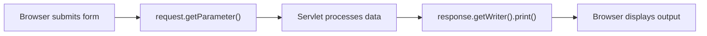

# HttpServletRequest and HttpServletResponse

### How Servlets Receive Data and Send It Back

> *"The request carries data in, the response sends data out — every servlet interaction is just this."*

---

## The Two Objects You Always Get

Every `doGet()` and `doPost()` method receives two parameters:

```java
@Override
protected void doGet(HttpServletRequest request, HttpServletResponse response)
        throws IOException {
    // request = what the browser sent you
    // response = how you send something back
}
```

| Object | Direction | Purpose |
|--------|-----------|---------|
| `HttpServletRequest` | Browser → Servlet | Read form data, URL parameters, headers |
| `HttpServletResponse` | Servlet → Browser | Send HTML/text back to the browser |

---

## Reading Form Data with `request.getParameter()`

When a user submits a form, the data arrives as **parameters** on the request object.

### The HTML form

```html
<form action="topic" method="post">
    <input type="text" name="topicName" />
    <input type="text" name="topicDescription" />
    <button type="submit">Add Topic</button>
</form>
```

### The servlet reads it

```java
@Override
protected void doPost(HttpServletRequest request, HttpServletResponse response)
        throws IOException {
    String name = request.getParameter("topicName");
    String description = request.getParameter("topicDescription");
    // name and description now hold whatever the user typed
}
```

| Detail | What to Know |
|--------|-------------|
| Parameter name | Must **exactly match** the `name` attribute in the HTML `<input>` |
| Return type | Always `String` — no casting needed |
| Missing parameter | Returns `null` if the name doesn't match anything |

---

## Sending a Response with `response.getWriter()`

To send output back to the browser, get a `PrintWriter` from the response object:

```java
@Override
protected void doGet(HttpServletRequest request, HttpServletResponse response)
        throws IOException {
    PrintWriter out = response.getWriter();
    out.print("<h1>Welcome, " + name + "</h1>");
    out.print("<p>Email: " + email + "</p>");
}
```

| Step | Code | What It Does |
|------|------|-------------|
| 1. Get the writer | `PrintWriter out = response.getWriter()` | Gets a writer connected to the browser |
| 2. Write output | `out.print("Hello")` | Sends text/HTML to the browser |

### Console vs Browser output

| Where | How | Use Case |
|-------|-----|----------|
| Console (server log) | `System.out.println(name)` | Debugging |
| Browser (client) | `response.getWriter().print(name)` | Actual response to the user |

---

## Key Methods

### HttpServletRequest

| Method | What It Does | Example |
|--------|-------------|---------|
| `getParameter("name")` | Get a form field value | `request.getParameter("topicName")` |

### HttpServletResponse

| Method | What It Does | Example |
|--------|-------------|---------|
| `getWriter()` | Get a `PrintWriter` to write output to the browser | `response.getWriter().print("Hello")` |

> Both interfaces have many more methods (headers, cookies, sessions) — these are the two you need right now.

---

## The Request-Response Cycle



---

## Key Takeaways

- `HttpServletRequest` and `HttpServletResponse` are **interfaces** — Tomcat provides the actual implementations
- `request.getParameter()` reads form data — the parameter name must match the HTML `name` attribute
- `response.getWriter()` gives you a `PrintWriter` to send output to the browser
- No type casting needed — `getParameter()` always returns a `String`
- Use `System.out.println()` for server-side debugging, `out.print()` for browser output
