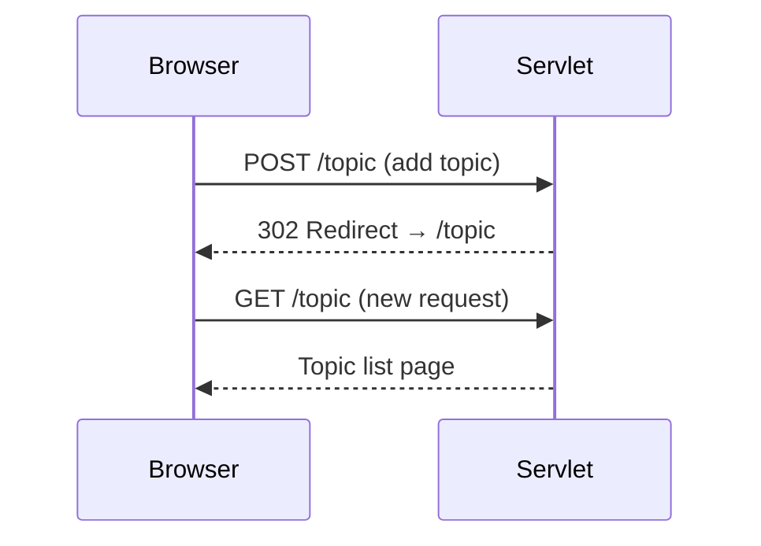
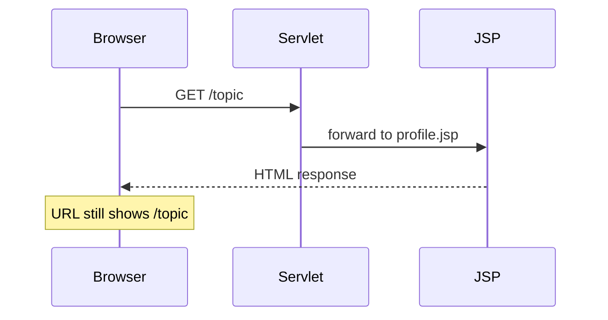

# Forward, Redirect, and Include

### Three Ways to Navigate Between Resources

> *"Redirect tells the browser to go somewhere else. Forward does it behind the scenes."*

---

## The Three Methods

| Method | What It Does | URL Changes? | Same Request? |
|--------|-------------|-------------|---------------|
| `response.sendRedirect(url)` | Tells the browser to make a **new request** to a different URL | Yes | No — new request |
| `request.getRequestDispatcher(path).forward(req, res)` | Server internally passes to another resource | No | Yes — same request |
| `request.getRequestDispatcher(path).include(req, res)` | Includes another resource's content in the current response | No | Yes — same request |

---

## sendRedirect — Go Somewhere Else

Used when you want the browser to navigate to a **different URL** — either external or internal.

```java
// Redirect to an external site
response.sendRedirect("https://www.google.com/search?q=" + searchTerm);

// Redirect within the app (after adding a topic)
response.sendRedirect("topic");
```



- The **URL changes** in the browser address bar
- A **new HTTP request** is created — the original request data is lost
- Called on `HttpServletResponse`

---

## RequestDispatcher.forward() — Pass Internally

Used when the servlet has done its work and wants to hand off to a **JSP or another servlet** within the same app.

```java
// Forward to a JSP page to display results
RequestDispatcher dispatcher = request.getRequestDispatcher("/pages/profile.jsp");
dispatcher.forward(request, response);
```



- The **URL stays the same** in the browser
- The **same request and response objects** are passed along
- Called on `HttpServletRequest`
- Any data set with `request.setAttribute()` is available in the forwarded resource

---

## RequestDispatcher.include() — Combine Content

Includes content from another resource into the **current response**. Unlike forward, it doesn't replace the response — it adds to it.

```java
// Show an error message AND include the login page
PrintWriter out = response.getWriter();
response.setContentType("text/html");
out.print("<h3 style='color:red'>Invalid credentials</h3>");

RequestDispatcher dispatcher = request.getRequestDispatcher("index.html");
dispatcher.include(request, response);
```

- The included resource's output is **merged** with the current response
- Useful for showing error messages alongside a page

---

## Passing Data with request.setAttribute()

When forwarding, you can attach data to the request for the JSP to use:

```java
// In the servlet
request.setAttribute("userName", "Deepak");
request.getRequestDispatcher("/pages/profile.jsp").forward(request, response);
```

```jsp
<!-- In the JSP -->
<h1>Welcome, ${userName}</h1>
```

This only works with **forward** and **include** — not with redirect (since redirect creates a new request, the attributes are lost).

---

## sendRedirect vs forward — When to Use Which

| Scenario | Use | Why |
|----------|-----|-----|
| After a form submission (POST) | `sendRedirect` | Prevents resubmit on refresh |
| Loading a JSP to display data | `forward` | Need to pass request attributes |
| Navigating to an external site | `sendRedirect` | Can't forward outside your app |
| Login success → profile page | `forward` | URL stays on `/login`, data preserved |
| Login failure → show error | `include` | Show error message with login form |

---

## Side-by-Side Comparison

| Aspect | `sendRedirect` | `forward()` | `include()` |
|--------|---------------|-------------|-------------|
| **URL in browser** | Changes | Stays the same | Stays the same |
| **Request type** | New HTTP request | Same request | Same request |
| **Request data** | Lost | Preserved | Preserved |
| **Called on** | `HttpServletResponse` | `HttpServletRequest` | `HttpServletRequest` |
| **Use case** | External navigation, post-submit | Internal page loading | Combining page content |
| **Server/Client** | Client-side (browser makes new request) | Server-side (internal) | Server-side (internal) |

---

## Key Takeaways

- `sendRedirect()` makes the browser send a **new request** — URL changes, original data is lost
- `forward()` passes the request **internally** on the server — URL stays the same, data is preserved
- `include()` merges another resource's output into the current response
- Use `request.setAttribute()` to pass data when forwarding — it won't survive a redirect
- Forward hides internal paths from the user, which is better for security
- `response.setContentType("text/html")` ensures the browser renders HTML correctly
