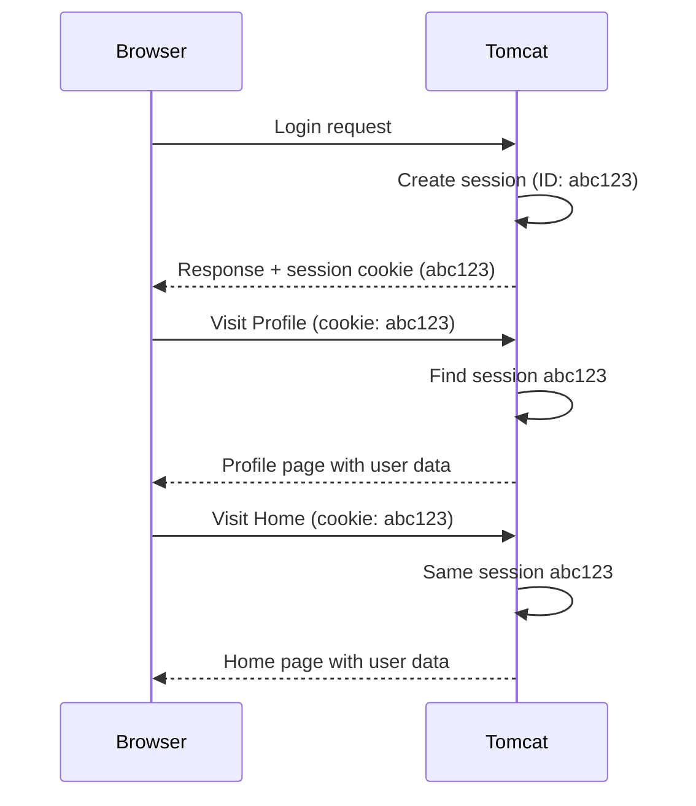

# HTTP Sessions

### Keeping Track of Users Across Pages

> *"The request dies after one page. The session survives until the user leaves."*

---

## The Problem: Request Data Doesn't Last

In the previous summary, we saw that `request.setAttribute()` passes data from a servlet to a JSP. But that data only lives for **one request**.

```
Login → Profile (name shows) → Home (name is gone!) → About (name is gone!)
```

The request object is **deleted** after each request-response cycle. If the user navigates to another page, the data is lost.

---

## The Solution: Sessions

A **session** stores data on the server that persists across **multiple requests** from the same user.

```
Login → store name in session → Profile (name shows) → Home (name shows) → About (name shows)
```

The session stays alive until the user logs out, the browser closes, or it times out.

---

## How to Use Sessions

### Step 1: Get the session object

```java
HttpSession session = request.getSession();
```

This returns the existing session or creates a new one if none exists.

### Step 2: Store values

```java
session.setAttribute("name", "Deepak");
session.setAttribute("email", "deepak@gmail.com");
session.setAttribute("city", "Mumbai");
```

### Step 3: Retrieve values (on any page)

```java
HttpSession session = request.getSession();
String name = (String) session.getAttribute("name");
String email = (String) session.getAttribute("email");
```

> `getAttribute()` returns `Object`, so you need to **cast** it to the right type.

---

## Session Methods

| Method | What It Does | Example |
|--------|-------------|---------|
| `request.getSession()` | Get or create a session | `HttpSession session = request.getSession()` |
| `setAttribute(key, value)` | Store a value in the session | `session.setAttribute("name", "Deepak")` |
| `getAttribute(key)` | Retrieve a value by key | `session.getAttribute("name")` |
| `removeAttribute(key)` | Remove a specific value | `session.removeAttribute("name")` |
| `invalidate()` | Destroy the entire session | `session.invalidate()` |

---

## Request vs Session — When to Use Which

| | Request Attribute | Session Attribute |
|--|-------------------|-------------------|
| **Lifespan** | One request-response cycle | Until logout, timeout, or browser close |
| **Scope** | Only available in the forwarded resource | Available across all pages |
| **Use case** | Passing data to a JSP for display | Keeping user identity across pages |
| **Set with** | `request.setAttribute()` | `session.setAttribute()` |
| **Get with** | `request.getAttribute()` | `session.getAttribute()` |

---

## Implementing Logout

Logout means destroying the session so all stored data is cleared:

```java
@WebServlet("/logout")
public class LogoutServlet extends HttpServlet {

    @Override
    protected void doGet(HttpServletRequest request, HttpServletResponse response)
            throws ServletException, IOException {
        HttpSession session = request.getSession();
        session.invalidate();  // destroy the session

        request.getRequestDispatcher("index.html").forward(request, response);
    }
}
```

After `invalidate()`, any call to `getAttribute()` on subsequent pages returns `null` — the user must log in again.

---

## How Sessions Work Behind the Scenes



| Concept | What Happens |
|---------|-------------|
| **Session created** | Server generates a unique **session ID** |
| **Cookie sent** | Session ID is sent to the browser as a cookie |
| **Subsequent requests** | Browser sends the cookie back automatically |
| **Server matches** | Tomcat finds the session object by its ID |
| **Multiple users** | Each user gets their own session with a unique ID |

---

## When Does a Session End?

| Trigger | What Happens |
|---------|-------------|
| `session.invalidate()` | Manual destruction (logout) |
| Browser closes | Session cookie expires (default behaviour) |
| Timeout | Server destroys session after inactivity (configurable in `web.xml`) |

Session timeout can be configured:

```xml
<!-- in web.xml -->
<session-config>
    <session-timeout>30</session-timeout>  <!-- minutes -->
</session-config>
```

---

## Key Takeaways

- The **request object** only lasts for one request — use it for passing data to a JSP
- The **session object** persists across multiple pages — use it for user identity (name, email, role)
- Get a session with `request.getSession()`, store data with `setAttribute()`, read with `getAttribute()`
- Destroy a session with `invalidate()` for logout
- Sessions work via a **session ID cookie** — the server matches each request to the right session
- Sessions expire on logout, browser close, or timeout
