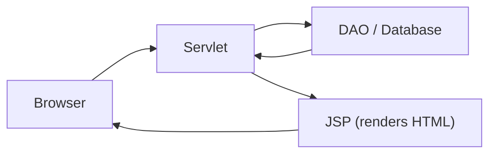

# Introduction to JSP

### Why We Don't Write HTML Inside Java

> *"Servlets are great for logic. Terrible for HTML. That's why JSP exists."*

---

## The Problem: HTML Inside Servlets

In a servlet, generating a dynamic page means writing HTML with `out.print()`:

```java
PrintWriter out = response.getWriter();
out.print("<html>");
out.print("<head><title>Profile</title></head>");
out.print("<body>");
out.print("<h1>Welcome, " + name + "</h1>");
out.print("<p>Email: " + email + "</p>");
out.print("<p>City: " + city + "</p>");
out.print("");
out.print("</body>");
out.print("</html>");
```

This gets painful fast — imagine a full profile page with CSS, navigation, and forms all written as Java strings.

---

## The Solution: JSP

**JSP (Java Server Pages)** flips it around — instead of writing HTML inside Java, you write **Java inside HTML**.

```jsp
<html>
<head><title>Profile</title></head>
<body>
    <h1>Welcome, ${name}</h1>
    <p>Email: ${email}</p>
    <p>City: ${city}</p>
    
</body>
</html>
```

Same result, much easier to read, design, and maintain.

---

## What Is JSP?

- **Java Server Pages** — a server-side scripting technology
- A JSP file is an **HTML page with embedded Java code**
- File extension: `.jsp`
- Processed on the server, the browser receives plain HTML

---

## Servlet vs JSP

| | Servlet (.java) | JSP (.jsp) |
|--|-----------------|------------|
| **Default format** | Java class | HTML page |
| **How you add the other language** | HTML embedded in Java (`out.print()`) | Java embedded in HTML (special tags) |
| **Primary role** | Business logic, request handling | Presentation, displaying data |
| **Ease of design** | Hard — HTML is strings in Java | Easy — it's just HTML with extras |
| **Maintainability** | Difficult for large pages | Much simpler |

---

## How They Work Together

The servlet handles the **logic**, the JSP handles the **display**:



| Layer | Responsibility | Example |
|-------|---------------|---------|
| **Servlet** | Receives request, runs logic, fetches data | `TopicServlet.doGet()` calls `topicDao.fetchAllTopics()` |
| **JSP** | Takes data from the servlet and renders HTML | `topiclist.jsp` displays the list of topics |
| **Browser** | Receives plain HTML — never sees Java code | User sees the topic list page |

---

## Why Not Just Use JSP for Everything?

You *could* put all your logic in JSP files, but it leads to the same problem in reverse — business logic mixed with HTML. The clean approach:

| Do This | Not This |
|---------|----------|
| Servlet handles logic → forwards to JSP | JSP queries the database directly |
| JSP only displays data | JSP contains if/else business rules |
| Separation of concerns | Everything in one file |

---

## Key Takeaways

- JSP was introduced because writing HTML inside servlets (`out.print()`) is complex and hard to maintain
- JSP is an **HTML page with embedded Java** — the opposite of a servlet
- Servlets handle **logic** (requests, DAO calls), JSPs handle **presentation** (HTML output)
- This separation makes code cleaner, easier to design, and easier to maintain
- JSP files are processed on the server — the browser only sees plain HTML
