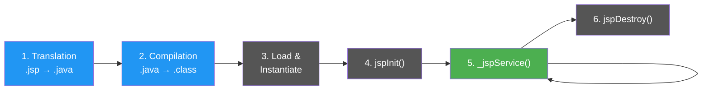

# The JSP Lifecycle

### JSP Pages Are Just Servlets in Disguise

> *"Every JSP becomes a servlet — the container just writes the boring parts for you."*

---

## JSP = Servlet + Two Extra Steps

You already know the servlet lifecycle has four stages. JSP adds **two more at the beginning** — translation and compilation — because a JSP file needs to be converted into a servlet before it can run.



The blue stages are **unique to JSP**. The rest are the same as the servlet lifecycle.

---

## The Six Phases

| Phase | What Happens | How Often | JSP Method |
|-------|-------------|-----------|------------|
| **1. Translation** | Container converts your `.jsp` file into a servlet `.java` file | Once (or when JSP changes) | — |
| **2. Compilation** | The generated `.java` file is compiled into a `.class` file | Once (or when JSP changes) | — |
| **3. Loading** | The `.class` file is loaded into memory and an instance is created | Once | — |
| **4. Initialisation** | The servlet instance is initialised | Once | `jspInit()` |
| **5. Request Handling** | Client requests are processed, dynamic content is generated | Every request | `_jspService()` |
| **6. Destruction** | The servlet is cleaned up and removed from memory | Once (server shutdown) | `jspDestroy()` |

---

## What the Container Generates

When you write this JSP:

```jsp
<%! String name = "Deepak Pawar"; %>
<html>
<body>
    <h1>Welcome</h1>
    <p>Name length: <%= name.length() %></p>
</body>
</html>
```

The container translates it into a servlet `.java` file with a `_jspService()` method that contains your HTML as `out.print()` calls and your Java code inline. You never see or edit this generated file — the container handles it.

---

## JSP Methods vs Servlet Methods

| JSP Method | Servlet Equivalent | When It Runs |
|------------|-------------------|-------------|
| `jspInit()` | `init()` | Once, after loading |
| `_jspService()` | `service()` | Every request |
| `jspDestroy()` | `destroy()` | Once, on shutdown |

You rarely override `jspInit()` or `jspDestroy()`. The `_jspService()` method is generated automatically from your JSP content — you don't write it yourself.

---

## JSP vs HTML — Why It Matters

| | HTML file (.html) | JSP file (.jsp) |
|--|-------------------|-----------------|
| **Dynamic code** | Ignored — displayed as plain text | Executed on the server |
| **Java expressions** | Not supported | `<%= expression %>` works |
| **Processed by** | Browser directly | JSP container on the server |
| **Output** | Static content only | Dynamic content based on data |

If you put `<%= 2 + 2 %>` in an HTML file, the browser shows the literal text. In a JSP file, the server evaluates it and sends `4`.

---

## Where Do the Generated Files Live?

The container stores the translated and compiled files in Tomcat's **work** directory. The exact path depends on your OS:

| OS | Typical Tomcat Path | Generated Files Location |
|----|---------------------|------------------------|
| **Windows** | `C:\xampp\tomcat\` | `C:\xampp\tomcat\work\Catalina\localhost\learning-logs\org\apache\jsp\` |
| **Mac** | `/usr/local/apache-tomcat-{version}/` | `/usr/local/apache-tomcat-{version}/work/Catalina/localhost/learning-logs/org/apache/jsp/` |

Inside that folder you'll find:

```
org/apache/jsp/pages/
    topiclist_jsp.java      ← generated servlet source
    topiclist_jsp.class     ← compiled servlet
```

> **Note on XAMPP:** Only the **Windows** version of XAMPP includes Tomcat. On **Mac**, XAMPP only ships Apache + MySQL + PHP — you'll need a standalone Tomcat installation. IntelliJ can also manage Tomcat for you via Run Configurations.

You don't need to look at these generated files, but knowing they exist helps when debugging — if a JSP has a syntax error, the error message references the generated `.java` file.

---

## Key Takeaways

- JSP pages are **converted into servlets** by the container — translation and compilation happen automatically
- The JSP lifecycle has **six phases**: translation, compilation, loading, initialisation, request handling, destruction
- The first two phases (translation + compilation) are **unique to JSP** and only run once (or when the JSP file changes)
- JSP lifecycle methods (`jspInit`, `_jspService`, `jspDestroy`) map directly to servlet lifecycle methods
- JSP files must be placed in the **webapp folder** (not in Java source folders)
- Unlike HTML, JSP can execute Java code on the server and generate dynamic content
